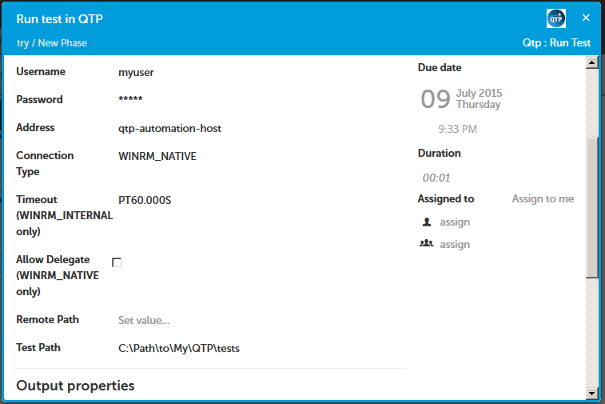

# xlr-qtp-plugin

### Introduction

 

QuickTest Professional (QTP) is now known as HP Unified Functional Testing.  This plugin should work with either product to support the execution of test sets via the products' Visual Basic Script (VBS) interface.

### Supported Tasks

#### Run test

Executes a QTP test set by invoking a VBS script on a Windows machine via WinRM. The machine is expected to have the QTP VBS interface installed. The script that is executed by the `Run Test` task can be modified by overriding the `qtp/RunTest.py` implementation script.

The task returns the standard out, standard error and exit code from the script.  You can use this information later in your release template to determine the test result and make decisions during the release.

**Input properties**

In addition to the standard properties of the [Windows remote script task](https://docs.xebialabs.com/xl-release/concept/introduction-to-the-xl-release-remote-script-plugin.html), this task provides the following properties:

* `testPath`: The path to the test set to be run. _Required_